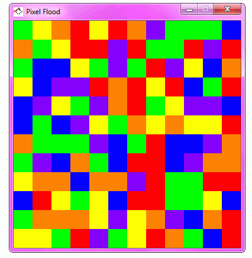

A set of puzzle and brain teaser games - written in both Go and C

The purpose of this project is to help build my knowledge of Go by writing the initial program in C then converting it to Go. I am also a die-hard fan of puzzle games and find them to be very addicting and stimulating. I plan to add many more games in the future, such as maze generators, cryptograms, crossword puzzles, and more!

## Pixel Flood

Generates a pixel grid in which the user must select one color at a time to paint the upper left square and flood into the same colors. The user must flood the entire grid with the same color in as few moves possible!

Controls:
- 1: Red
- 2: Green
- 3: Blue
- 4: Orange
- 5: Yellow
- 6: Purple
- n: New Puzzle
- Escape: Exit program

## Sudoku

A classic sudoku puzzle generator. Currently only command line.

`sudoku > puzzle.txt`

Will generate both the puzzle and solution. Default starts at 20 squares.
